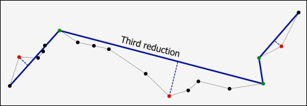
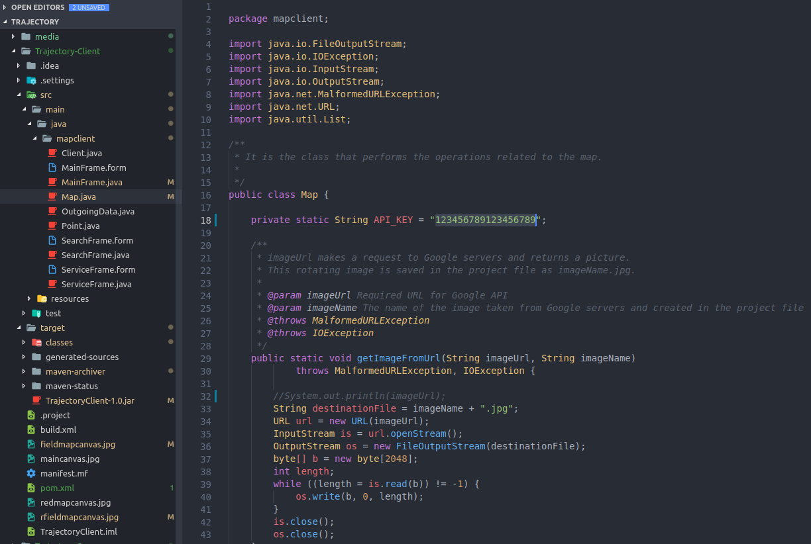
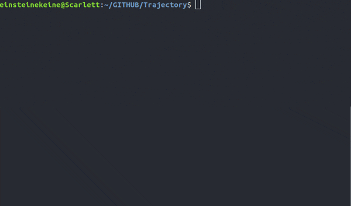
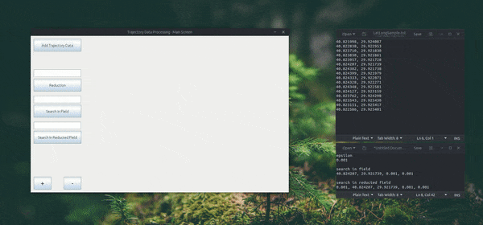
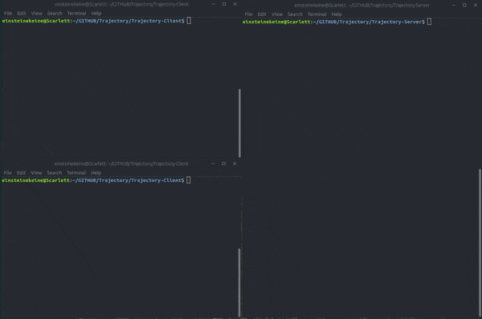
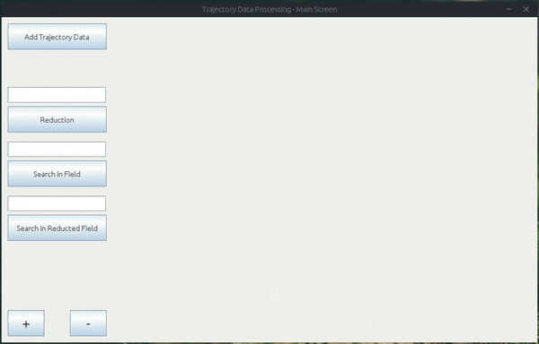

# MapTrajectory

[](https://www.linkedin.com/in/brkyzdmr/)
  
<br/>
<p  align="center">
  
</p>
<br/>

<h3  align="center">Map Trajectory</h3>
<p  align="center">
  In this project, it is possible to send the trajectory data, which is taken as a text document by the help of an interface in the client side, to the server side and allows various reduction operations. The server visualizes trajectory data using the Google API and returns the result to the user after performing the reduction by using the Ramer-Douglas-Peucker algorithm. Thus, intersecting nodes in he data set can be searched in a squared area fastly. Because the server has a multithreaded structure, it can provide support to more than one client.

  <br/>
  <a  href="https://en.wikipedia.org/wiki/Ramer%E2%80%93Douglas%E2%80%93Peucker_algorithm"><strong>For more information »</strong></a>
  <br/>
</p>

<!-- TABLE OF CONTENTS -->

## Table of Contents

- [MapTrajectory](#maptrajectory)
  - [Table of Contents](#table-of-contents)
  - [Technologies and Data Structures](#technologies-and-data-structures)
    - [Technologies](#technologies)
    - [Data Structures](#data-structures)
  - [Getting Started](#getting-started)
    - [Prerequisites](#prerequisites)
    - [Installation](#installation)
  - [Usage](#usage)
    - [Input Example](#input-example)
    - [Multithreaded Processing Example](#multithreaded-processing-example)
    - [Hints](#hints)
  - [License](#license)

  

## Technologies and Data Structures

### Technologies
* <a  href="https://www.java.com/en/">`Java`</a>
* <a  href="https://maven.apache.org/">`Maven`</a>
* <a  href="https://cloud.google.com/maps-platform/maps/?utm_source=google&utm_medium=cpc&utm_campaign=FY18-Q2-global-demandgen-paidsearchonnetworkhouseads-cs-maps_contactsal_saf&utm_content=text-ad-none-none-DEV_c-CRE_269776058347-ADGP_Hybrid+%7C+AW+SEM+%7C+BKWS+~+EXA_%5BM:1%5D_TR_EN_Google+Maps+Brand-KWID_43700020521464562-kwd-298247230465-userloc_9056787&utm_term=KW_google%20maps%20api-ST_google+maps+api&gclid=CP__2sKqz-ACFZG6GwodU10Eog">`Google Maps API`</a>

### Data Structures
* <a  href="https://en.wikipedia.org/wiki/Quadtree?oldformat=true">`Quad Tree`</a>
* <a  href="https://www.geeksforgeeks.org/introducing-threads-socket-programming-java/">`Multithread Server Architecture`</a>
* <a  href="https://en.wikipedia.org/wiki/Ramer%E2%80%93Douglas%E2%80%93Peucker_algorithm?oldformat=true">`Ramer–Douglas–Peucker Algorithm`</a>

## Getting Started

### Prerequisites

1. You need to install these packages before run the project.

* java-8

```bash
sudo apt install openjdk-8-jdk
```

* maven

```bash
sudo apt install maven
```

2. You need to take an Google Maps API key
```
https://cloud.google.com/maps-platform/maps/
```

  

### Installation

1. Install Maven
```bash
sudo apt install maven
```

2. Clone the repo
```bash
git clone https://github.com/brkyzdmr/MapTrajectory.git
```

3. Set the API key

<p align="left">
<br>
</p>

```bash
./Trajectory-Client/src/main/java/mapclient/Map.class
```

4. Go to <a  href="/Trajectory-Server">`Trajectory-Server`</a>  sub-folder then build and run
```bash
mvn clean install exec:java
```

<p align="left">
<br>
</p>

5. After the server starts, go to <a  href="/Trajectory-Client">`Trajectory-Client`</a> sub-folder then build and run
```bash
mvn clean install exec:java
```
<p align="left">
<br>
</p>


## Usage

<p align="left">
<br>
</p>

### Input Example

```txt
# epsilon
0.001

# search in field
40.824207, 29.921739, 0.001, 0.001

# search in reducted field
0.001, 40.824207, 29.921739, 0.001, 0.001
```

### Multithreaded Processing Example

<p align="left">
<br>
</p>

### Hints

<p align="left">
<br>
</p>

## License

Distributed under the MIT License. See <a  href="/LICENSE.txt">`LICENSE`</a> for more information.
